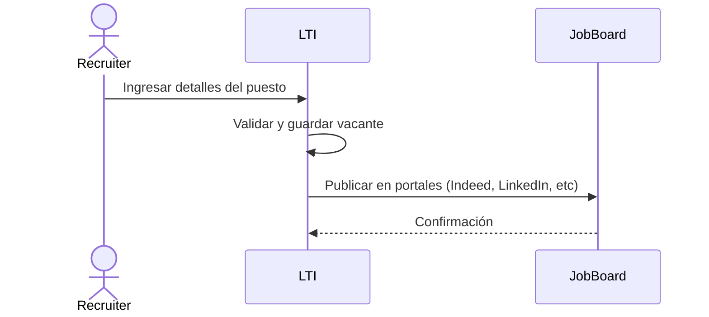
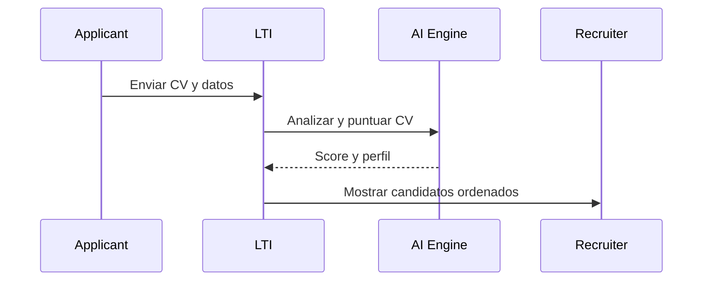
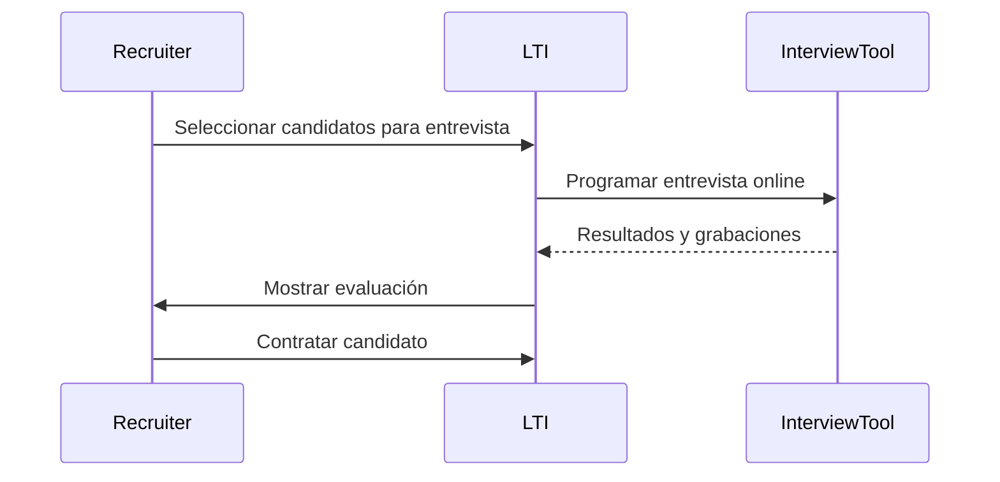
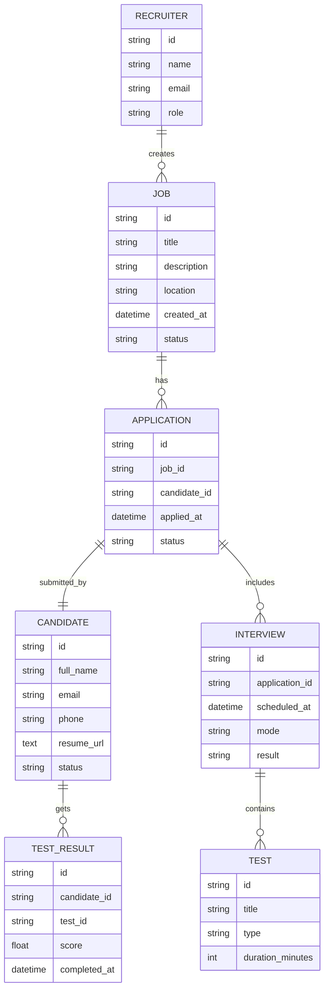
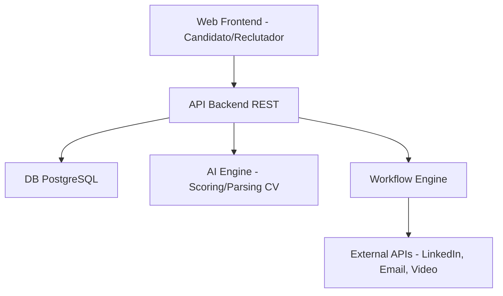
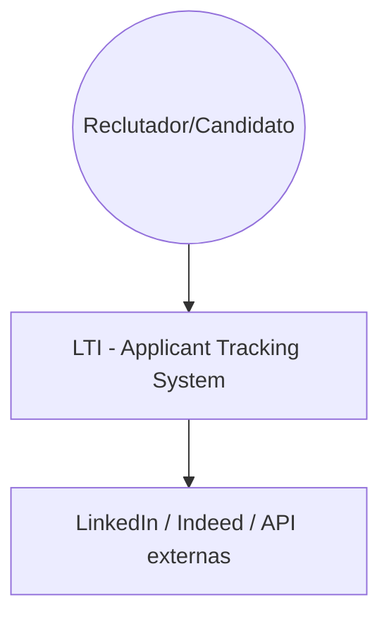
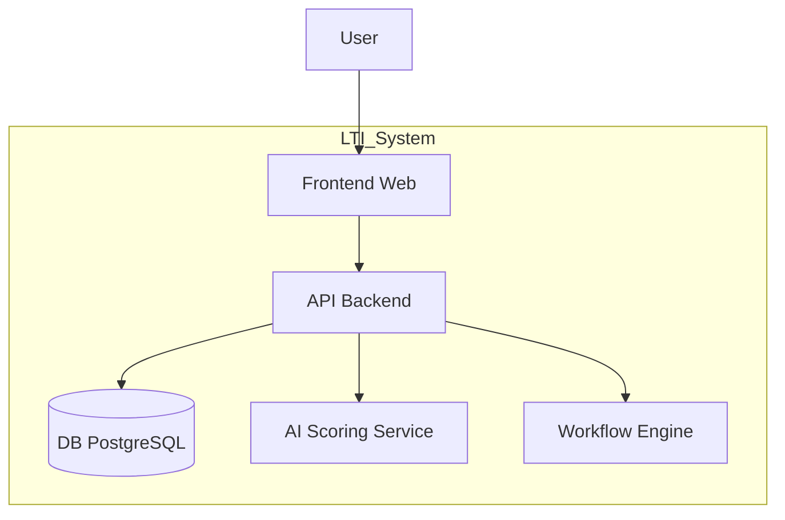
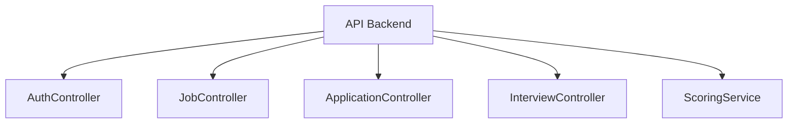

# LTI - Applicant Tracking System del Futuro

## 1. 📘 Descripción del Software

**LTI** es un sistema ATS (Applicant Tracking System) moderno, inteligente y modular que facilita el proceso de reclutamiento de extremo a extremo: desde la creación de vacantes hasta la contratación final. LTI se diferencia al integrar automatización, IA y análisis en tiempo real para tomar decisiones más rápidas y eficientes.

### 🏆 Ventajas Competitivas
- Automatización inteligente del proceso de reclutamiento.
- Análisis de datos en tiempo real sobre candidatos y procesos.
- IA para screening automático de CVs y sugerencia de candidatos.
- Integración omnicanal: web, redes sociales, job boards.
- Experiencia amigable tanto para candidatos como para reclutadores.

### 🔑 Funciones Principales
1. Crear y publicar vacantes.
2. Recibir y analizar postulaciones automáticamente.
3. Realizar pruebas y entrevistas en línea.
4. Visualizar pipelines y métricas en tiempo real.
5. Contratar y generar informes automáticos.

---

## 2. 🧩 Lean Canvas (Modelo de Negocio)

### Herramienta recomendada: [https://canvanizer.com](https://canvanizer.com)

Contenido para pegar en Canvanizer:

```
Problem:
- Procesos manuales y lentos de reclutamiento
- Dificultad para evaluar miles de CVs
- Mala experiencia del candidato

Customer Segments:
- Startups tecnológicas
- Empresas medianas en expansión
- Consultoras de recursos humanos

Unique Value Proposition:
ATS inteligente que automatiza y optimiza todo el proceso de contratación con IA, pruebas integradas y dashboards.

Solution:
- Publicación multicanal
- Screening automático por IA
- Entrevistas y pruebas online
- Pipeline visual
- Análisis de candidatos

Channels:
- Web
- LinkedIn / Social media
- Partners de RRHH
- Marketplace de ATS

Revenue Streams:
- Licencia mensual SaaS
- Add-ons: analítica avanzada, integración con CRM

Cost Structure:
- Desarrollo y mantenimiento de plataforma
- Infraestructura cloud
- Marketing y ventas

Key Metrics:
- Tiempo medio de contratación
- Tasa de conversión de postulantes
- NPS del candidato y reclutador

Unfair Advantage:
- Algoritmo propio de scoring inteligente
- Experiencia UX optimizada
```

---

## 3. 🔄 Casos de Uso Principales

### 🎯 Crear Vacante


### 📥 Procesar Aplicaciones


### 📅 Entrevistar y Seleccionar


---

## 4. 🧬 Modelo de Datos



---

## 5. 🏗️ Diseño de Alto Nivel



---

## 6. 🧱 Diagrama C4

### 🧭 Contexto


### 🧱 Contenedores



### ⚙️ Componentes (API Backend)


### 💻 Código - ScoringService
```python
# scoring_service.py
import spacy

class ScoringService:
    def __init__(self, job_desc):
        self.job_desc = job_desc
        self.nlp = spacy.load("en_core_web_sm")

    def compute_score(self, resume_text):
        jd_doc = self.nlp(self.job_desc)
        res_doc = self.nlp(resume_text)
        score = jd_doc.similarity(res_doc)
        return round(score * 100, 2)
```