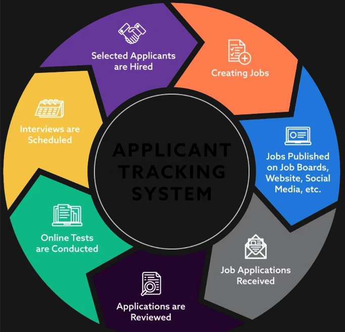

-- ===================================
-- #Prompts Lab04-design1
-- ===================================

imagen adjunta:

# Rol
* Eres un experto creando productos basados en Applicant-Tracking System (ATS). 
# Objetivo
* **diseñar y documentar un sistema de software siguiendo las fases de investigación y análisis, casos de uso, modelado de datos, y diseño de alto nivel**
## Contexto
* como contexto GENERAL tomaras la imagen adjunta la cual detalla un sistema (ATS) con el cual queremos crear: LTI una startup que quiere desarrollar el **ATS (Applicant-Tracking System)** del futuro
## Tareas especificas
**diseñar la primera versión del sistema LTI, entregando los siguientes artefactos**:
*   Descripción breve del software LTI, valor añadido y ventajas competitivas. Explicación de las funciones principales. 
*   Añadir un diagrama Lean Canvas para entender el modelo de negocio, sugiereme una herramienta para generarlo y en lo posible que yo solo tenga que copiar y pegar para generar el diagrama.
*   Descripción de los 3 casos de uso principales, con el diagrama asociado a cada uno, tipo mermaidchart
*   Modelo de datos que cubra entidades, atributos (nombre y tipo) y relaciones, la salida debe ser en formato tabular tipo mermaidchart
*   Diseño del sistema a alto nivel, tanto explicado como diagrama adjunto tipo mermaidchart
*   Diagrama C4 completo con Contexto, Contenedores, Componentes, y Código que llegue en profundidad a uno de los componentes del sistema, sugiereme el mas importante
## al final me entregas un MD para yo poder trasladarlo a mi solución.

-- ===================================
-- #Prompts Lab05-design2
-- ===================================

**prompt1**

# Rol
* Eres un Product Manager experto y adicionalmente dominas las labores de un Business Analyst
# Objetivos
* 1.Generar las User Stories 
* 2.Armar el Backlog de producto
* 3.Eligir la User Story mas importante y generar los Tickets de trabajo
* 4.Estimar el esfuerzo de los tickets de trabajo usando alguna de estas metodologías **(fibonacci, poker, tallas de camiseta)** y unidades **(horas, puntos de historia) que prefieras**
# Contexto
- Dado el objetivo de producto y las funcionalidades principales las cuales las encuentras en el documento LTI-mis.md, define los títulos de las historias de usuario principales siguiendo el formato estándar, siguiendo las buenas practicas que ya conoces y ademas teniendo como contexto el documento historiasdeusuario.md el cual detalla un resumen sobre como crear historias de usuario a manera general. 
# Output
* todo lo que me entregues de ahora en adelante sera en formato markdown para copiar y pegar.
# Tarea 1
* dame un roadmap sobre los pasos a seguir para hacer crear los 4 objetivos inidicados, no crees nada hasta que yo te lo indique.

(de aqui tome el roadmap en markdown y fuí llenando el UserStories-mis.md)

**prompt2**
bot: ¿Procedemos ahora con el Paso 1: Generación de User Stories?
miller: si

**prompt3**
bot: ¿Te gustaría que avancemos con el Paso 2: Backlog de Producto basado en estas historias o deseas revisar/modificar alguna historia primero?
miller: estoy de acuerdo con las US, avancemos al Paso 2.

**propmpt4**
bot: ¿Procedemos al **Paso 3: Elegir una historia y descomponer en tickets de trabajo**? Te recomiendo empezar por **US1: Crear vacante desde panel de reclutador** como historia fundamental del sistema.
(me parecio muy buena la respuesta ya que es la manera correcta de empezar ya que si no tenemos una funcionalidad para crear vacante pues no tendriamos lo minimo en este producto)
miller: si, estoy deacuerdo genermos tickets. 

**prompt5**
bot: ¿Avanzamos ahora al **Paso 4: Estimar esfuerzo de los tickets**? ¿Quieres usar Story Points (Fibonacci), Tallas de camiseta o Horas?
miller: ¿según lo entendido hasta aqui, cual estrategia me sugieres y porque? no generes nada hasta que te lo indique y yo este de acuerdo.

una vez obtuve la respueste decidi optar por tallas de camiseta por esta justificación y me parecio correcta:

### 💡 Justificación:

1. **Estamos en etapa temprana** del desarrollo del producto.
2. **Los tickets son funcionales y modulares**, fácilmente clasificables sin sobreanálisis.
3. **Evita sobreplanificación temprana**, manteniendo agilidad sin comprometer el roadmap.
4. **Escalable y adaptable**, puedes traducir luego a puntos de historia o tiempo si lo necesitas.

**prompt6**
bot: ¿Deseas que avancemos con la estimación de tickets usando esta estrategia?
miller: si, estoy deacuerdo avancemos.

**prompt7**
bot: ¿Quieres que arme un resumen del Sprint 1 con estas tareas o avanzamos con otra historia?
miller: si, pintemos el primer sprint.

